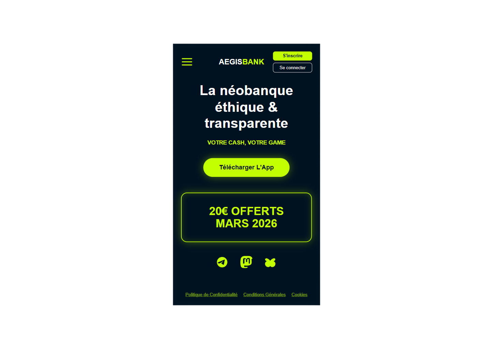

# 🏦 Aegis Bank | La néobanque éthique & Transparente

Bienvenue sur le projet **Aegis Bank**, une landing page conçue pour offrir une alternative éthique et transparente aux néobanques traditionnelles. 

## 🚀 Présentation du projet
Ce projet a été réalisé dans le cadre de ma formation en développement web à l'EFP (2026). Il se concentre sur une interface **mobile-first**, garantissant une expérience utilisateur fluide et respectueuse de la vie privée.

## 🛠 Stack Technique & Architecture
Le développement a été réalisé en **HTML5 et CSS3 pur** :
- **Approche Mobile-First** : Interface optimisée pour le viewport.
- **Architecture BEM** : Structure CSS modulaire et maintenable.
- **Design System** : Utilisation de variables CSS pour une charte graphique cohérente.
- **Sémantique HTML** : Structure optimisée pour l'accessibilité.

## ✨ Fonctionnalités clés
- Navigation adaptative (menu mobile).
- Gestion unifiée des couleurs via variables CSS.
- Design responsive cross-device.

## 📦 Installation
Pour cloner et tester le projet localement :
1. `git clone https://github.com/salcheu/aegis-bank`
2. Ouvrir `index.html` dans votre navigateur.

## 🌐 Déploiement
Le projet est hébergé en direct via Netlify :
https://aegisbank-saracheu.netlify.app/

## 💎 Démarche Qualité (Clean Code)
Ce projet respecte les standards du développement front-end moderne :
- **Validation** : Code conforme aux standards du Web.
- **Accessibilité** : Utilisation de balises sémantiques pour une navigation inclusive.

## 🤝 Contribution
Ce projet est un exercice pédagogique réalisé dans le cadre de ma formation. Toute suggestion visant à améliorer la structure CSS ou l'accessibilité est la bienvenue. 
